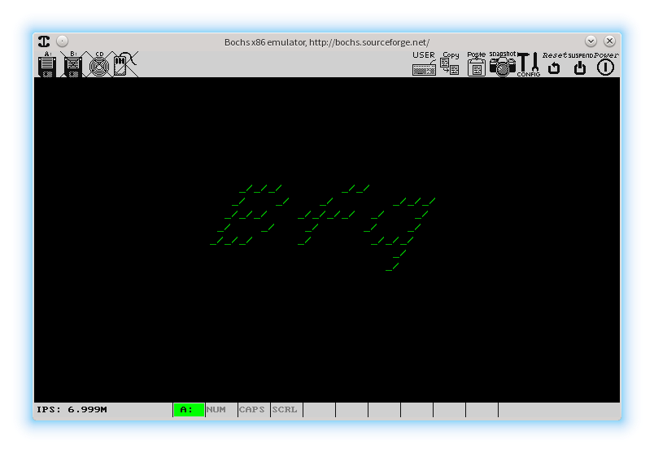
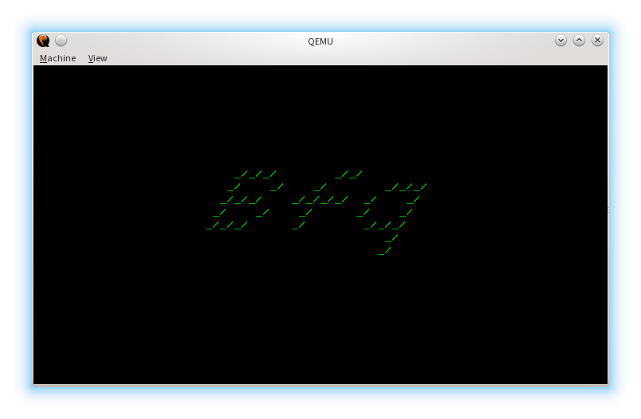
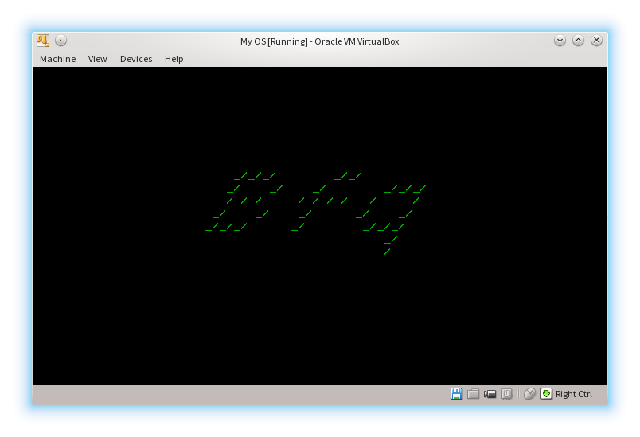

# Bare-metal Hello World

Simple x86 Assembly example explaining how to make bootable "Hello World".

## Stage 1
This part resides in MBR and contains simple bootstrap to next stage

## Stage 2
This stage resides above MBR and below 2KiB (typical alignment of first
partition)

## How to build
Simply type "make" inside a project directory. You must have GNU or BSD Make,
NASM/YASM and Python 3.

Final image works as a hard drive.

### Debugging
Run make with DEBUG set to:

- 0 - No debugging
- 1 - Emit BOCHS specific debug instruction (xchg bx, bx)
- 2 - Emit standard debugger breakpoint (int3)
- 3 - Emit both
- 4 - Loop forever (jmp $)

Ex: make DEBUG=1 clean all

## How to use
Project contains Bochs config designed to work in any supported UNIX-like OS.
You could also run it in QEMU, or any another virtual (or real) machine…

### Real machine:
Write *boot.img* to any USB stick or other bootable medium.
Be sure to use BIOS based PC, or enable CSM mode in your UEFI setup.
You'll need x86_64 class PC, just because this code will jump to 64b mode of CPU.
Why? Because. That's why :)

### Bochs:

    bochs -q

### QEMU

    qemu-system-x86_64 -hda boot.img

### VirtualBox/VMWare/Other virtual machine

Add *boot.img* as a hard drive.

