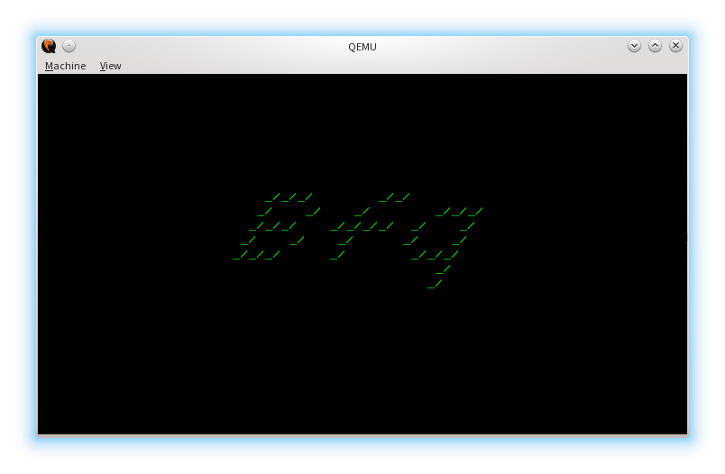

## Bare-metal Hello World

Simple x86 Assembly example explaining how to make bootable "Hello World".

### Stage 1
This stage resides in MBR and contains simple bootstrap to next stage

### Stage 2
This stage resides above MBR and under 2KiB (typical alignment of first
partition)

### How to build
Simply type "make" inside project directory. You must have GNU or BSD Make,
and NASM.

Final image works either as a floppy and a hard drive.

### How to use
Project contains Bochs config designed to work in any supported UNIX-like OS.
You could also run it in QEMU, or any another virtual (or real) machine…

#### Bochs:

    bochs -q

#### QEMU

    qemu-system-i386 -cpu pentium -boot a -fda boot.img
